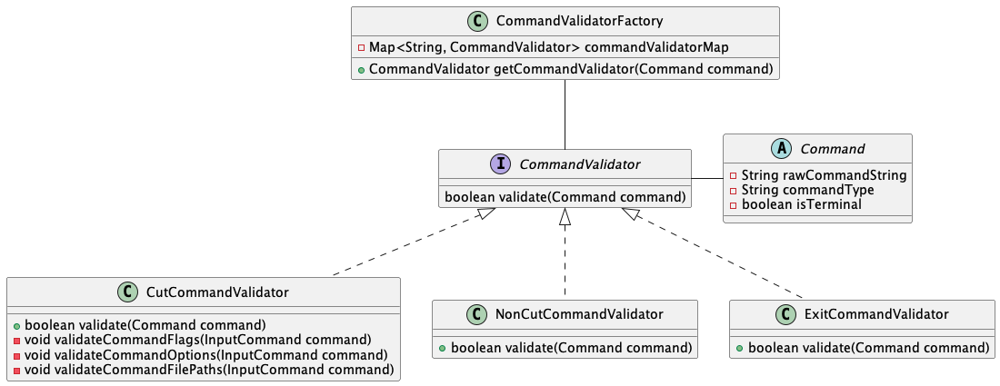
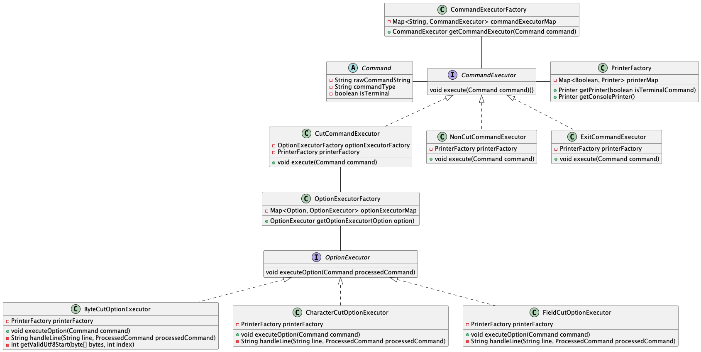
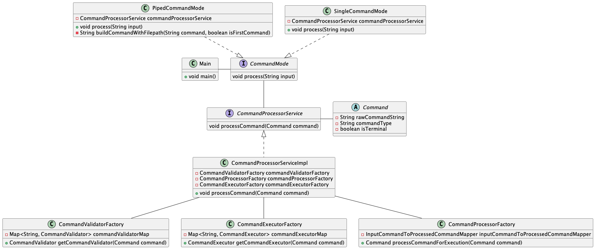
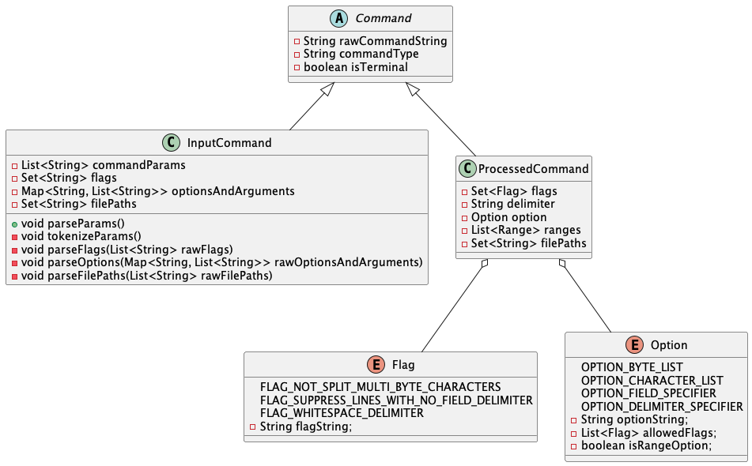

# cut-command-line-tool
A simple implementation of `cut` command in Java

### Options and Flags implemented:
1. Implemented all the possible options in the command utility `-c`, `-b`, and `-f`
2. The flags associated with the options are also implemented
   1. `-n` for `-b` option
   2. `-s` and `-w` or `-d` for `-f` option

### Core-Components:
1. **Command Validator**: Validates the given command. Whether it is a valid command and fails with 
a related message if it isn't a valid one. 
The class diagram for the same can be found below:

 
2. **Command Executor**: Executes the command and outputs the output to the terminal.
The class diagram for the same can be found below:

 
3. **Processor Service**: Both Validation and Execution of the given input command string will be done by Processing
service. First of all, the input is checked for any pipes if present and handled accordingly. 

### Representation
`Command` is handled in two different ways. If the command is not cut, we can simply pass it to System for 
processing further. Else we will use `InputCommand` while validation and `ProcessedCommand` in case of Execution.
 

