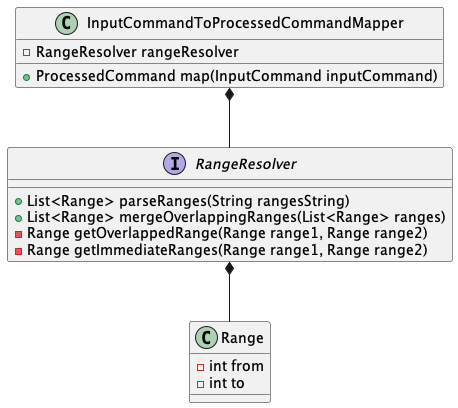

# cut-command-line-tool
A simple implementation of `cut` command in Java

### Options and Flags implemented:
1. Implemented all the possible options in the command utility `-c`, `-b`, and `-f`
2. The flags associated with the options are also implemented
   1. `-n` for `-b` option
   2. `-s` and `-w` or `-d` for `-f` option

### Flow
The flow of the command through various components of the application is shown below. 
1. The input command is 
handled on two major _modes_ as a standalone command (SingleMode in the image) or as a Piped command. 
In any of the modes, the handling of `cut` command is same either as an **intermediate** command or a **terminal** command. 
2. Once the mode is decided, the command is processed for the first time tokenizing every component of the command possible.
In this processing, the command is categorised as cut, non-cut or an exit command. Options, their args and flags are splitted. 
3. Followed by _processing_1_, if the command is cut it is _validated_. Here we validate the command for the potential
invalid options, args or flags. Any invalid param will fail the flow with an appropriate error message. 
4. The validation is followed by _processing_2_. Here the command is processed again for range resolution (main area of work of cut command), 
option and flag parsing. 
5. Next comes the _Execution_, where we execute the command based on the options and flags specified.

### Core-Components:
#### **Processor Service**:
1. Both Validation and Execution of the given input command string will be done by Processing
service. First of all, the input is checked for any pipes if present and handled accordingly.
2. In the below image, both `CommandValidatorFactory` and `CommandExecutorFactory` are the entry points
into the Validator and Executor services respectively. These components and explained neatly in the below sections.

#### **Command Validator**: 
1. Validates the given command. Whether it is a valid command and fails with 
a related message if it isn't a valid one. 
2. The validator is obtained based on the type of the command from the factory and type of the command essentially means if it is cut, non-cut or exit command
 
The class diagram for the same can be found below:

#### **Command Executor**: 
1. Executes the command and outputs the output to the terminal.
2. The executor for a given type of command is obtained from the factory and is handled accordingly.
3. In Cut-command, each option has a separate executor to make the handling better.
 
The class diagram for the same can be found below:

### Representation
#### Command
1. `Command` is handled in two different ways. 
2. If the command is not cut, we can simply pass it to System for 
processing further. 
3. Else we will use `InputCommand` while validation and `ProcessedCommand` in case of Execution.

#### Range
1. The main use-case of cut command lies in its ability to handle the range of columns, which are represented here
as `Range`s.
2. `Range` has _from_ and _to_ attributes.
3. Ranges are resolved from the command by `RangeResolver` and are passed in the `ProcessedCommand` for the execution.

